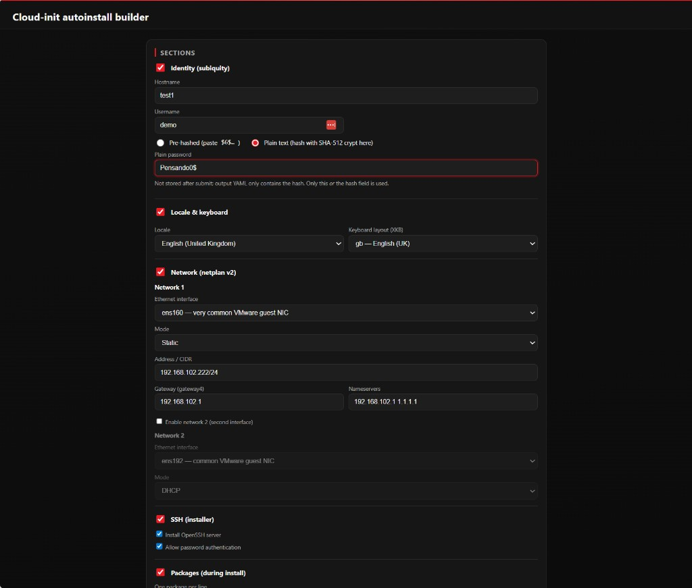
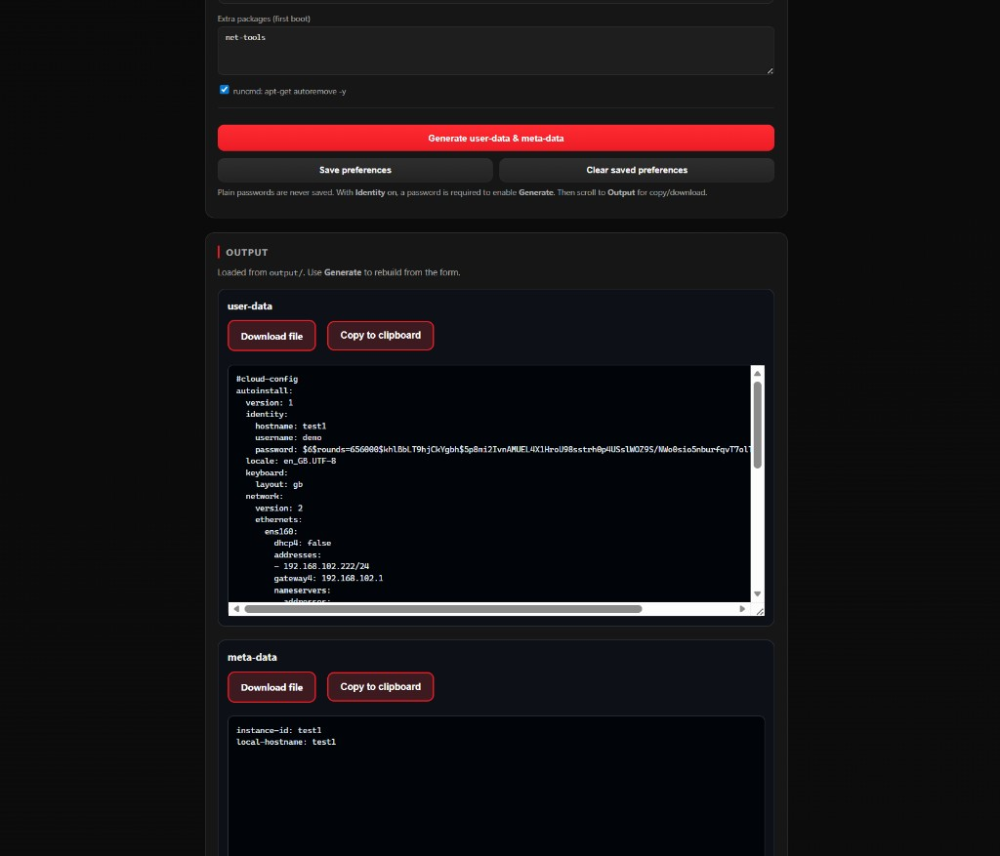

# Cloud-init autoinstall builder

Web UI to build Ubuntu subiquity/autoinstall `#cloud-config` **user-data** and NoCloud **meta-data** from form fields.

## Screenshots

**Configuration** — identity (hostname, user, password), locale & keyboard, netplan network, SSH, packages, hosts-file entries, and related sections.



**Output** — generated `user-data` and `meta-data` with **Download file**, **Copy to clipboard**, and **Download NoCloud ISO (cidata)** when `genisoimage` is available (Docker image; optional load from `output/` on refresh).



## Paths and behavior

**`initial/`** (`~\Cloudinit_builder\initial`) supplies the default **user-data** / **meta-data** templates.

On startup, if **`backup/`** (`~\Cloudinit_builder\backup`) contains saved preferences, those override **`initial/`**; otherwise only **`initial/`** is used.

**Generate** writes fresh files to **`output/`** (`~\Cloudinit_builder\output`).

**NoCloud meta-data** in the builder is derived from **hostname** only (`instance-id` and `local-hostname`).

When enabled, the **Update /etc/hosts** section writes a first-boot cloud-init `write_files` entry for `/etc/hosts` using your provided `IP hostname` lines.

In each **Late cloud-init user** row, you can set SSH config blocks (`Host`, `HostName`, `User`, `IdentityFile`). They are persisted in preferences and written to `/home/<user>/.ssh/config` with `0600` permissions.

In each **Late cloud-init user** row, you can upload private key files for that specific user. Uploaded keys are written to `/home/<user>/.ssh/` with `0600` permissions, and key contents are used only for generation (not saved in preferences).

**Preferences file:** `~\Cloudinit_builder\backup\preferences.json`.

**Environment overrides:** `CLOUDINIT_INITIAL_DIR`, `CLOUDINIT_OUTPUT_DIR`, `CLOUDINIT_BACKUP_DIR`, `CLOUDINIT_PREFS_FILE`.

When you use those variables, the resolved directories replace the paths above.

## Setup and run

From the project root:

```bash
python -m venv venv
source venv/bin/activate  # or venv\Scripts\activate on Windows

pip install .
python app.py
```

Port and options are configured in `app.py` under `if __name__ == "__main__"`.

## Docker

Build the image from the project root:

```bash
docker build -t cloudinit_builder .
```

When you want to refresh the image after code changes, rebuild with the same tag:

```bash
docker build --pull -t cloudinit_builder:latest .
```

Run the container and map the app output to a local `output/` folder under your current directory:

```bash
mkdir -p output
docker run --rm -p 10000:10000 -v "$(pwd)/output:/app/output" cloudinit_builder
```

Stop the app:

- Press `Ctrl+C` in the terminal running the container.

Optional:

- Run detached: `docker run -d -p 10000:10000 -v "$(pwd)/output:/app/output" --name cloudinit_builder cloudinit_builder`
- Stop detached container: `docker stop cloudinit_builder`

### Update image and restart with new image

If you are using a named container (for example `cloudinit_builder`), use this flow to rebuild and start a container from the new image:

```bash
docker build --pull -t cloudinit_builder:latest .
docker stop cloudinit_builder
docker rm cloudinit_builder
docker run -d --restart unless-stopped -p 10000:10000 -v "$(pwd)/output:/app/output" --name cloudinit_builder cloudinit_builder:latest
```

After that, a normal restart command works for future restarts of the same container:

```bash
docker restart cloudinit_builder
```

Then open `http://127.0.0.1:10000`.

The image includes **genisoimage**. After **Generate**, use **Download NoCloud ISO (cidata)** in the Output section to build and download a NoCloud seed ISO from the files in the mounted `output/` folder (nothing is written to disk except the two text files).

On the host, you can still build an ISO manually from a seed folder:

```bash
genisoimage -output example.iso -volid cidata -joliet -r output/
```